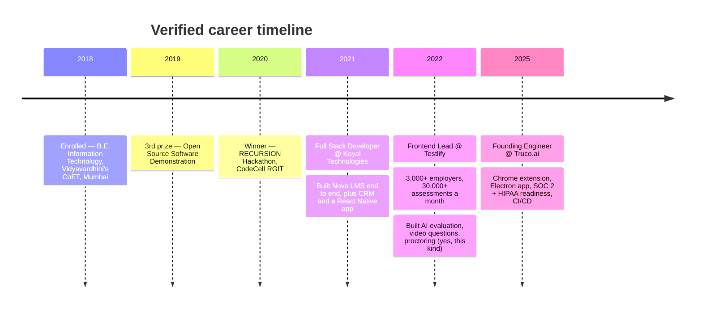
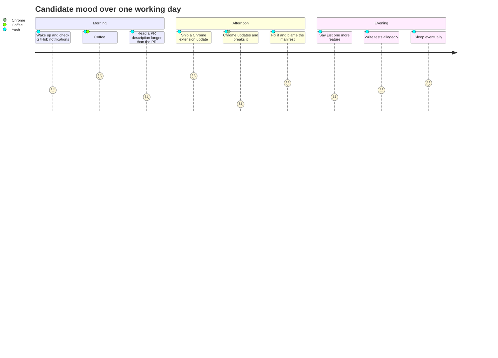

<p align="center">
  
</p>

> [!IMPORTANT]
> This report was auto-generated by an AI evaluator. The candidate built the evaluator. The evaluator has been asked to remain impartial. The evaluator has agreed, in writing, which the candidate also wrote.

<br>

<table width="100%">
<tr>
<td width="50%" valign="top">

### 📋 Candidate snapshot

| Field | Value |
|---|---|
| Name | Yash Raut |
| Current title | Founding Engineer @ Truco.ai |
| Years shipping | 5+ (rounded down, for humility) |
| Location | Mumbai, IN — *see proctoring map below* |
| Platforms | Web, desktop, mobile, browser extension |
| Meetings survived | ∞ (he builds the tool that records them) |
| Coffee | Present |

</td>
<td width="50%" valign="top">

### 🧮 Section scores

| Section | Score | Bar |
|---|:--:|---|
| Frontend | 96 | `▓▓▓▓▓▓▓▓▓░` |
| Backend / APIs | 89 | `▓▓▓▓▓▓▓▓▓░` |
| Shipping things | 98 | `▓▓▓▓▓▓▓▓▓▓` |
| AI agents | 91 | `▓▓▓▓▓▓▓▓▓░` |
| Naming variables | 71 | `▓▓▓▓▓▓▓░░░` |
| Closing browser tabs | 12 | `▓░░░░░░░░░` |
| **Overall** | **93** | `▓▓▓▓▓▓▓▓▓░` |

</td>
</tr>
</table>

<br>

## 🚩 Proctoring flags

> [!WARNING]
> **Gaze deviation detected 47 times.** Investigation revealed a second monitor. It contained documentation. Flag downgraded to *"studious."*

> [!CAUTION]
> **Ctrl+C / Ctrl+V events: 0.** The candidate typed every line by hand. This is either integrity or a broken clipboard. Both are concerning.

> [!NOTE]
> **Background audio detected:** keyboard sounds at ~140 WPM, one sigh at the 2h mark, and something that sounded like *"just one more feature."*

> [!TIP]
> **Multiple faces detected: 1.** The other one was a Figma mockup with a very realistic avatar.

<br>

## 📍 Location verification

The candidate's IP resolves to Mumbai. The candidate's commit timestamps resolve to *"whenever."* Both have been accepted.

```geojson
{
  "type": "FeatureCollection",
  "features": [
    {
      "type": "Feature",
      "properties": { "name": "Candidate location — verified", "status": "Shipping from here" },
      "geometry": { "type": "Point", "coordinates": [72.8777, 19.0760] }
    }
  ]
}
```

<br>

## 🕰️ Employment history <sub>(cross-checked against LinkedIn, GitHub, and a hackathon certificate found in a drawer)</sub>



<br>

## 📈 Behavioural assessment: a typical day <sub>(self-reported, un-verifiable, suspiciously cheerful)</sub>



<br>

## ⌨️ Skills matrix <sub>(keystrokes observed during session)</sub>

<p>
<kbd>JavaScript</kbd> <kbd>TypeScript</kbd> <kbd>Python</kbd> <kbd>React</kbd> <kbd>Next.js</kbd> <kbd>Vue.js</kbd> <kbd>Nuxt.js</kbd> <kbd>React Native</kbd> <kbd>Electron.js</kbd>
<br><br>
<kbd>Node.js</kbd> <kbd>Express</kbd> <kbd>Flask</kbd> <kbd>REST APIs</kbd> <kbd>MongoDB</kbd> <kbd>Redis</kbd> <kbd>Firebase</kbd> <kbd>Socket.IO</kbd>
<br><br>
<kbd>OpenAI</kbd> <kbd>Claude</kbd> <kbd>AI agents</kbd> <kbd>Google Cloud</kbd> <kbd>Vercel</kbd> <kbd>GitHub Actions</kbd> <kbd>CI/CD</kbd> <kbd>Tailwind</kbd>
<br><br>
<kbd>Ctrl</kbd> + <kbd>Z</kbd> <sub>(used with confidence)</sub> &nbsp;·&nbsp; <kbd>Ctrl</kbd> + <kbd>Shift</kbd> + <kbd>T</kbd> <sub>(used with regret)</sub>
</p>

<br>

## 🧪 Portfolio submissions <sub>(reviewed by the AI, then by a human, then by the AI again because the human was busy)</sub>

<details>
<summary><b>🎬 MovieX</b> — Movie Discovery Web App &nbsp;·&nbsp; <i>Verdict: PASS</i></summary>
<br>

Responsive movie explorer with trailers, search and TMDB metadata.
**Evaluator note:** candidate built an app to find movies to watch, then kept building the app instead of watching movies. Classic.

`React` `Next.js` `Tailwind CSS` `Vercel`
</details>

<details>
<summary><b>🧳 Tripora</b> — AI Travel Companion, Mobile App &nbsp;·&nbsp; <i>Verdict: PASS</i></summary>
<br>

Generates day-by-day itineraries from destination, duration, budget and interests, adapts to live weather, and lets you argue with it conversationally until the plan is right.
**Evaluator note:** the itinerary generator has taken more trips than the candidate.

`React Native` `Node.js` `LLM API` `Weather API` `Maps API` `Firebase`
</details>

<details>
<summary><b>🃏 Codename</b> — Multiplayer Picture Game &nbsp;·&nbsp; <i>Verdict: PASS</i></summary>
<br>

Real-time multiplayer over WebSockets, separate frontend/backend services, Redis-backed game history so the losses persist forever.
**Evaluator note:** flagged for "synchronized game updates." Turned out to be a feature.

`Next.js` `Socket.IO` `Express` `Redis` `Tailwind CSS`
</details>

<details>
<summary><b>📦 Open source</b> — npm + pub.dev packages &nbsp;·&nbsp; <i>Verdict: PASS</i></summary>
<br>

- **YouTube Thumbnail Grabber** — npm package that pulls YouTube thumbnails. Does one thing. Does it.
- **GlassWidget** — Flutter package of reusable Glass UI components for Android and iOS. See-through, unlike most code.
</details>

<br>

## 🧠 Free-response section

<details>
<summary><b>Q1.</b> Tell us about yourself.</summary>
<br>

> I take products from a rough idea to something people actually rely on — web, desktop, mobile, browser extension, whatever the problem needs. I like working close to founders, owning the whole stack, and I'm permanently curious about the tools that make the next build faster.

*AI evaluation:* Coherent. Confident. Slightly too many platforms for one person. Score: 9/10.
</details>

<details>
<summary><b>Q2.</b> Describe a time you handled a difficult stakeholder.</summary>
<br>

> Chrome.

*AI evaluation:* Concise. Relatable. Score: 10/10.
</details>

<details>
<summary><b>Q3.</b> Where do you see yourself in five years?</summary>
<br>

> Probably still saying "one more feature" at 11pm, but with better CI.

*AI evaluation:* Honest. Deducted one point for the CI already being pretty good. Score: 9/10.
</details>

<br>

## 🔬 Quantitative analysis

Estimated feature output for the candidate over any given sprint:

$$
\text{features shipped} \;=\; \int_{0}^{\text{deadline}} \frac{\text{coffee}(t)}{\text{meetings}(t) + 1}\; dt \;+\; \varepsilon_{\text{hackathon}}
$$

where $\varepsilon_{\text{hackathon}}$ is a positive constant established in 2020 and never fully explained.

<br>

## 📊 Activity log <sub>(pulled from the candidate's GitHub while they weren't looking)</sub>

<details>
<summary>Expand activity</summary>
<br>
<p align="center">
  
  
</p>
</details>

<br>

## ✅ Final verdict

<table width="100%">
<tr>
<td align="center" width="25%"><b>Recommendation</b><br><br>🟢 HIRE</td>
<td align="center" width="25%"><b>Availability</b><br><br>Employed, but always up for a chat</td>
<td align="center" width="25%"><b>Cheating detected</b><br><br>No — just documentation</td>
<td align="center" width="25%"><b>Report status</b><br><br>Archived. Candidate hired himself.</td>
</tr>
</table>

<br>

<p align="center">
  <a href="https://www.yashraut.me"><kbd>🌐 yashraut.me</kbd></a>&nbsp;
  <a href="https://linkedin.com/in/yashraut362"><kbd>💼 LinkedIn</kbd></a>&nbsp;
  <a href="mailto:yashraut362@gmail.com"><kbd>✉️ Email</kbd></a>&nbsp;
  <a href="https://github.com/yashraut362?tab=repositories"><kbd>📁 Repositories</kbd></a>
</p>

<p align="center">
  <sub>Session ended. Recording saved. The candidate would like it noted that the second monitor was, in fact, documentation.</sub>
</p>
